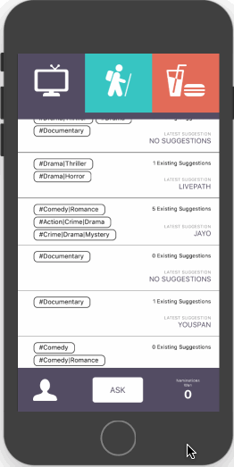
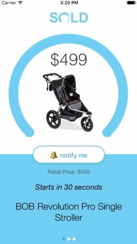
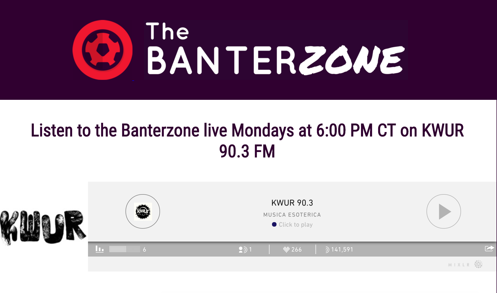

# Personal Portfolio
A running list of my programming adventures.  
Feel free to reach out to me to me about projects, opportunities or anything else at owenauch@wustl.edu

## Professional
### Asktag -- A mobile app for social questions.

  

During my junior year of college, I was asked by a few investors if I was interested in bootstrapping an MVP for their mobile app concept. Their idea was Asktag, a mobile app for users to ask for suggestions from one another via hashtags. As an opportunity to lead the development of a full stack app from scratch, I agreed and got to work. I diagrammed and implmented a database in Postgresql, and linked it up with a Node backend using Sequelize as an ORM. I also developed the application front end with React Native from a provided design, focusing intently on building modular and functional components in order to maximize reuse and minimize technical debt. Furthermore, I took on the role of a product manager as well, setting goals and timelines for myself in the development process. I eventually passed the project off to another developer, but in my time working on the app, I became a far more competent full stack developer, improving my ability to understand the technical requirements of a project and implement them efficiently and effectively. Additionally, I improved my ability learn new technologies quickly and act independently to overcome challenging problems.
<h4 align="center">Asktag in development:</h4>

  

 

### SOLD -- [App](https://itunes.apple.com/us/app/sold-make-shopping-a-game/id1221206557?mt=8) + [Site](https://www.withsold.com/)

  

I worked last summer with SOLD Technologies developing an ecommerce app that gamifies shopping through a reverse auction mechanism for selling products. I was hired as an intern, but quickly assumed the role of Head of Engineering due to changes in the team, and in the short time I was there, I developed an MVP into a production application with hundreds of monthly active users. I learned more quickly than I ever have at SOLD because virtually every concept, library, framework and technology I implemented was new to me before the summer, and I loved the fast-paced environment and chance to think creatively, make significant technical decisions and solve hard problems. Our iPhone application has a React Native frontend with a Ruby on Rails and PostgreSQL backend, which were exciting and fun tecnologies to learn and work in.
 

## Personal

### Ethereum Bar Bet -- [Contract and Frontend Code](https://github.com/owenauch/bar-bet-ethereum)

  

After some initial skepticism, I have fallen deep down the blockchain rabbit hole and have been learning as much as I can about the technology. I learn best by building something myself, so I decided to build a decentralized app (dapp) on the Ethereum network as a chance to better understand the technology. I made a dapp to allow two people to place a basic bar bet arbitrated by a third party, all decentralized on Ethereum. I wrote the smart contract in Solidity, which I found very easy and intuitive to work with, and wrote the frontend in React using web3.js and an integration with Metamask. The dapp allows a person to create a bet by sending ether to the contract, and then the other person taking the bet can post the same amount of ether in order to accept the bet. Then, a third party designated beforehand can decide the winner of the bet, which awards the entire pot of ether to the winner. The React interface makes the contract easy to interact with. I had a lot of fun making this dapp and learning more about blockchain tech. Blockchain and cryptocurrencies are my main area of interest at the moment, so feel free to reach out with project ideas or opportunities in this space. I'm hoping to learn more in any way I can.
 

### Queen Nine -- [App Code](https://github.com/owenauch/queen-nine) + [Server Code](https://github.com/owenauch/queen-nine-backend)

  

Every summer, my friends and I play the card game Euchre constantly, and after countless arguments about whether different hands are good enough to call trump (an essential part of the game), I decided to make an app for us to record our calls. Queen Nine is an app that lets a Euchre player record the trump cards in his hand, the trump suit, the rating of the non-trump cards in his hand, and whether he won or lost the trick. It's designed to be simple and quick, so information about the last hand can be entered as cards are being shuffled for the next hand.

I used React Native and Expo to build the app, which allows it to easily be run on ios and android. The backend server was built in NodeJS, using Express and Mongoose to authenticate users and store calls in a MongoDB database on MLab. Tests for the app are run using Jest. Because I wrote both the frontend and the backend in Javascript, this app was incredibly quick to develop, and I had a blast learning these technologies and applying them to a project that I knew my friends and I would use frequently.

Furthermore, after recording hundreds of calls, I trained a machine learning model to predict the chance of winning a hand given a specific hand using the data via Amazon Machine Learning. We learned some really interesting things from the model, as it was much more optimistic about the chances of winning than we normally are. I hope to continue to make the model more accurate as we gather more data. 
 

### Fantasy Soccer League -- [Frontend Code](https://github.com/owenauch/react-fantasy-soccer) + [Backend Code](https://github.com/owenauch/django-fantasy-soccer)
I've been a soccer fanatic for years, and I've played and watched soccer constantly for as long as I can remember. One year, my friends and I decided instead of fantasy football, we wanted to start a fantasy soccer league. However, as we searched the internet, we couldn't find a service that met our vision for the league -- we wanted a league that resembled real soccer management as closely as possible. Our league had to have all 5 top European leagues, players bought and sold with in-league money, and the ability for each person in the league to retain their league for multiple years instead of redrafting each year.

Because a league of this sort didn't exist, we decided to create it ourselves. We wrote out a 10 page rule document and ran the league through Slack and Google Sheets. It was a tremendous success in its first year, but setting lineups and gathering player stats was time-consuming, so I set out to create a custom website to manage the league.

I decided to learn Django for the backend, and used Django Rest Framework to create an API that fetched data on players periodically from an API and proccessed it to keep updated stats for every soccer player in the world. The backend also stores each person in the league's weekly rosters and calculates their players' scores in real-time. League members update their lineups and view their scores from a React frontend that was custom-built as well.

This was a really challenging project but eventually worked as designed. However, the site is currently down because we maxed out the free trial of the stats API and couldn't afford to pay for a subscription. I believe that a fantasy soccer site of this sort could have mass market appeal, so if you are interested in working on or funding this idea, please let me know. It's a project I would love to pursue further.
 

### Double Agent Intelligence -- [Site](http://double-agent-intel.herokuapp.com/) + [Code](https://github.com/owenauch/agent-intelligence)
A simple project that offered me a chance to learn how to configure a Spring Boot backend server to serve location data, and then a Bootstrap and LeafletJS front-end to visualize the data. Being a poor college student, it's hosted on Heroku's free tier, so give the dyno a moment to wake up if you click the link.

  

 

### Doubting Thomas Explorer -- [Code](https://github.com/owenauch/doubting-thomas-explorer)

  

Because of the deep influence of faith on my life, I thought it would be fun to make a Python scraper and script to explore Bible cross references. The first script takes in a user-specified verse and displays its cross-references, and then allows the user to find the cross references of any of the verses it returns. The second script takes in a user-specified verse and recursively finds cross references using a depth-first search algorithm, and formats the information to a CSV file. Both scripts scrape from Bible Gateway, and developing them taught me a tremendous amount about scraping and recursive algorithms.
 

### The Banterzone Web Site -- [Site](http://washubanterzone.com/)

  

At Wash U, a few friends and I host a weekly sports talk radio show on the university radio station called The Banterzone. After a few weeks, we decided that we wanted to be able to interact with our listeners more directly, so I built a simple website for our radio show. Hosted at www.washubanterzone.com, our site allows users to stream our show online and submit questions and conversation topics, which all the hosts can see once they log in. I built the site in PHP with a basic MySQL database to hold user and question data, and it's hosted on Amazon Web Services. We've received some awesome questions and feedback from listeners because of the site, and building it was a great chance to better learn PHP, SQL, web app deployment, and user experience.
 

### The Porzingis Project -- [Code](https://github.com/owenauch/NBA-Fantasy-Optimizer)
As a first foray into web scraping and a chance to fuel a sports addiction in a productive way, I created a script to generate an optimal NBA daily fantasy lineup by scraping NBA player data from Basketball Reference, TeamRankings and Rotowire and analyzing it. The script scrapes the most recent data on each player active on a given night, and uses their season statistics to generate an expected fantasy points per game. Determining a optimal lineup that maximizes total expected fantasy points while taking into account the cost of each player with a fixed salary cap is an example of the Knapsack problem, an NP-complete problem in computer science, and I tackled it by using a greedy algorithm with a heuristic of preferencing undervalued players.
 

## Academic: [all code available here](https://github.com/owenauch/Class-Assignments)
### Free Food Finder -- [Site](http://free-food-finder.s3-website.us-east-2.amazonaws.com/) + [Code](https://github.com/owenauch/Class-Assignments/tree/master/CSE%20330%20(Rapid%20Prototype%20Development%20and%20Creative%20Programming)/Free%20Food%20Finder%20MERN%20App)
For our final project in CSE 330 at Wash U, we decided to tackle an age-old college problem: finding free food on campus. We built a web app that allowed students to post events on campus that offered free food, and then displayed these events in a live map of campus showing all the events with free food. My partner for this project was [Visaal Ambalam](https://github.com/visaals).

For the back-end, we used NodeJS with Express to build an API and saved event data in a MongoDB database. For the front-end, we used ReactJS as our framework, as well as LeafletJS for the map and Bootstrap to style the site. We both learned a great deal about the advantages and challenges of working with cutting-edge technologies like React, MongoDB and Node, and how to prototype our ideas quickly and apply our knowledge to new frameworks with ease. We hosted it via Heroku's free tier, so give the dyno a moment to wake up if you visit the site.

  

 

### Multi-Room Chat Server -- [Site](http://ec2-52-14-44-219.us-east-2.compute.amazonaws.com:3456/chat.html) + [Code](https://github.com/owenauch/Class-Assignments/tree/master/CSE%20330%20(Rapid%20Prototype%20Development%20and%20Creative%20Programming)/Multi-Room%20Chat%20Server)
As a chance to learn the basics of asynchronous web communication and web sockets, [Visaal](https://github.com/visaals) and I built a multi-room chat server with Node.JS and Socket.io. This taught us how to use a server to communicate with many clients simultaneously and exposed us to several new and developing technologies in web development.
